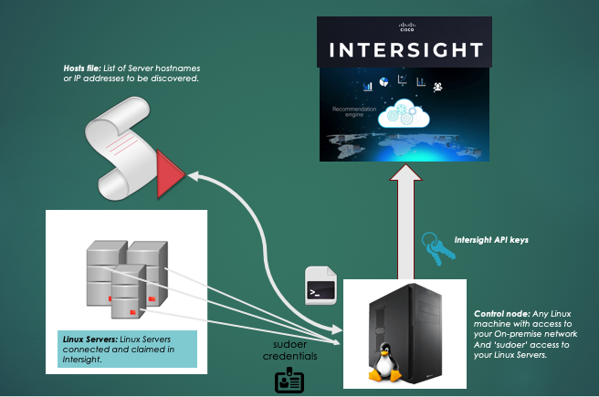

## **ODT (OS Discovery Toolset) scripts**

## Introduction
#### *This toolset enables Cisco Intersight account holders to push server OS inventory to Intersight in order to evaluate the server's HCL validity as it pertains to http://ucshcltool.cisco.com*


---
## File list
```Bash

[odt-user@host: ~/intersight-python/os-discovery-tool]$ ls -l
total 124
-rwxrwxr-x. 1 odt-user odt-user    72 Feb  8 14:45 centos-os-name-legacy.sh
-rwxrwxr-x. 1 odt-user odt-user   103 Dec 14 13:56 centos-os-name.sh
-rwxrwxr-x. 1 odt-user odt-user   125 Dec 14 13:56 debian-os-name.sh
-rwxrwxr-x. 1 odt-user odt-user   135 Feb  8 14:45 debian-os-version.sh
-rw-rw-r--. 1 odt-user odt-user   150 Feb  8 14:45 discovery_config_linux.json
-rwxrwxr-x. 1 odt-user odt-user   294 Feb  8 14:45 fcdev.sh
-rwxrwxr-x. 1 odt-user odt-user   200 Feb  8 14:45 fcdriver.sh
-rwxrwxr-x. 1 odt-user odt-user   263 Feb  8 14:45 fcversions.sh
-rwxrwxr-x. 1 odt-user odt-user 25028 Feb 23 22:30 get_linux_inv_to_intersight.py
-rwxrwxr-x. 1 odt-user odt-user   291 Feb  8 14:45 gpu.sh
-rw-rw-r--. 1 odt-user odt-user    60 Feb  8 14:45 hosts
-rwxrwxr-x. 1 odt-user odt-user   287 Feb  8 14:45 netdev.sh
-rwxrwxr-x. 1 odt-user odt-user   291 Feb  8 14:45 netdriver.sh
-rwxrwxr-x. 1 odt-user odt-user   412 Feb  8 14:45 netversions.sh
-rwxrwxr-x. 1 odt-user odt-user    82 Feb  8 14:45 osvendor-legacy.sh
-rwxrwxr-x. 1 odt-user odt-user   100 Dec 14 13:56 osvendor.sh
-rw-rw-r--. 1 odt-user odt-user 13578 Feb 23 22:30 README.md
-rwxrwxr-x. 1 odt-user odt-user    88 Feb  8 14:45 redhat-os-name.sh
-rwxrwxr-x. 1 odt-user odt-user   286 Feb  8 14:45 storagedev.sh
-rwxrwxr-x. 1 odt-user odt-user   291 Feb  8 14:45 storagedriver.sh
-rwxrwxr-x. 1 odt-user odt-user   407 Feb  8 14:45 storageversions.sh
-rwxrwxr-x. 1 odt-user odt-user   313 Feb  8 14:45 validate-tools.sh

```
---
## Setup Steps
---  
  ### I. Pre-requisites/dependent components for setting up the Control Node 
  1. A Linux machine (Virtual/Physical) with access to your on-prem network. We will call this the **Control Node**. Check that you have the latest version of python 2 (2.7 or later) installed. 
     - Please NOTE: This utility does not support python 3.
  2. **Generate Intersight API keys** with your user account from the Cisco Intersight GUI and use them as described in the next section.
  3. **Install Intersight Python SDK**: Clone this repository on the **Control Node** as described below and follow the build instructions available here: https://github.com/CiscoUcs/intersight-python. 
   ```Bash
  	 $ git clone https://github.com/CiscoUcs/intersight-python.git
   ```  
  ---
  ### II. Pre-requisites/dependent components for Target Servers
  1. **Claim your servers:** Ensure that all your linux servers are claimed in Cisco Intersight. We will call these **Target Servers**. This toolset validates only the claimed servers by their serial numbers and their connectivity to Intersight.  
  2. **Install necessary packages:** Make sure the **lsmod**, **lspci** (pci-utils) and **lshw** commands are installed and available on the **Target servers**. Supported Linux flavors: **RHEL, Ubuntu Sever and CentOS**
  3. **User access**: Ensure that the odt-user has sudo access to **Target Servers** using the ssh **authorized keys** listing the odt-user's public key (sudoer access must be password-less).
  ---
  ### III. Setup configurations
  Edit discovery_config_linux.json to include details as described below. Refer to the comments for additional help. NOTE: Comments are not supported in JSON; please don't leave comments in your configuration files.
  ```Bash
   [odt-user@host: ~/intersight-python/os-discovery-tool]$ cat discovery_config_linux.json 
    {
        "config": {
                # hosts file for the list of hosts to discover
                "hosts_file_path": "/home/odt-user/hosts",
                # intersight URL to be used to push inventory
                "intersight_url": "https://intersight.com/api/v1",
                # public intersight API key
                "intersight_api_key": "59552af60b1905000195be54/59552aec0b1905000195bde5/5becc002673738387ab2cc1b",
                # path of private intersight API key file
                "intersight_secret_file": "/home/odt-user/Downloads/SecretKey.txt",
                # path or location where log files will be created
                "logfile_path": "/tmp"
        }
    }
   ```
  ---
  ### IV. Run toolset
  #### i. get_linux_inv_to_intersight.py
  ```Bash
    [odt-user@host: ~/intersight-python/os-discovery-tool]$ ./get_linux_inv_to_intersight.py --help
    Usage: get_linux_inv_to_intersight.py [options]

    Options:
    -h, --help            show this help message and exit
    -l, --log-inventory   [OPTIONAL] Log OS Inventory to log file location
                            configured
    -f CONFIGFILE, --configfile=CONFIGFILE
                            [MANDATORY] Filesystem path to configuration file for
                            ODT
  ```
  
  #### Example run of get_linux_inv_to_intersight.py
  ```Bash
    [odt-user@host: ~/intersight-python/os-discovery-tool]$ ./get_linux_inv_to_intersight.py --log-inventory --configfile=discovery_config_linux.json
    [INFO]: Starting ODT for list of hosts in hosts file
    [INFO]: Using logging mode...
    [INFO]: Using log file: /tmp/intersight_os_discovery_2018-12-10T19:48:08.114636.log
    [INFO]: Found 2 hosts in ./hosts
    --------------------------------------------------------------
    [INFO]: Processing host: ubuntu-server
    --------------------------------------------------------------
    --------------------------------------------------------------
    [ubuntu-server]: Extracting OS Inventory... 
    --------------------------------------------------------------
    [ubuntu-server]: Extracting driver Inventory... 
    [ubuntu-server]: Extracting Server Serial Number... 
    Connection to ubuntu-server closed.
    [ubuntu-server]: Host Serial Number: FLM2042NYYM
    [ubuntu-server]: Extracting Server MO Identity from Intersight... 
    [ubuntu-server]: Server MO Identity: 5bce7116683663343218ed92
    [ubuntu-server]: No Changes detected in OS Inventory, skipping...
    --------------------------------------------------------------
    [INFO]: Processing host: centos-server
    --------------------------------------------------------------
    --------------------------------------------------------------
    [centos-server]: Extracting OS Inventory... 
    --------------------------------------------------------------
    [centos-server]: Extracting driver Inventory... 
    [centos-server]: Extracting Server Serial Number... 
    Connection to centos-server closed.
    [centos-server]: Host Serial Number: FCH17427P4K
    [centos-server]: Extracting Server MO Identity from Intersight... 
    [centos-server]: Server MO Identity: 5bce7116683663343218ed96
    [centos-server]: Changes detected in OS Inventory, pushing to intersight...
    --------------------------------------------------------------
    [INFO]: ODT push to Intersight completed!
    --------------------------------------------------------------

  ```
  #### Example log file
  ```Bash
  [odt-user@host: ~/intersight-python/os-discovery-tool]$ cat /tmp/intersight_os_discovery_2018-12-10T19\:48\:08.114636.log
    [2018-12-10 20:25:01.541247]------------------------START-TIMESTAMP--------------------------                                                       
    [2018-12-10 20:25:16.237309][ubuntu-server]: Intersight MO Identifier: 5bce7116683663343218ed92                                             
    [2018-12-10 20:25:16.237327][ubuntu-server]: Building OS Inventory Collection...                                                            
    [2018-12-10 20:25:16.237515][                                                                                                                       
        {                                                                                                                                               
            "Key": "intersight.server.os.updateTimestamp",                                                                                              
            "Value": "2018-12-10T20:25:10.438Z"                                                                                                         
        },                                                                                                                                              
        {                                                                                                                                               
            "Key": "intersight.server.os.updateVersionString",                                                                                          
            "Value": ""                                                                                                                                 
        },                                                                                                                                              
        {                                                                                                                                               
            "Key": "intersight.server.os.kernelVersionString",                                                                                          
            "Value": "Ubuntu Server 16.04.5 LTS"                                                                                                        
        },                                                                                                                                              
        {                                                                                                                                               
            "Key": "intersight.server.os.releaseVersionString",                                                                                         
            "Value": "4.4.0-140-generic"                                                                                                                
        },                                                                                                                                              
        {                                                                                                                                               
            "Key": "intersight.server.os.type",
            "Value": "Linux"
        },
        {
            "Key": "intersight.server.os.vendor",
            "Value": "Ubuntu"
        },
        {
            "Key": "intersight.server.os.name",
            "Value": "Ubuntu"
        },
        {
            "Key": "intersight.server.os.arch",
            "Value": "x86_64"
        },
        {
            "Key": "intersight.server.os.driver.0.name",
            "Value": "enic"
        },
        {
            "Key": "intersight.server.os.driver.0.version",
            "Value": "2.3.0.20"
        },
        {
            "Key": "intersight.server.os.driver.0.description",
            "Value": "Cisco Systems Inc VIC 1340 MLOM Ethernet NIC"
        },
        {
            "Key": "intersight.server.os.driver.1.name",
            "Value": "RAID"
        },
        {
            "Key": "intersight.server.os.driver.1.version",
            "Value": "6.810.09.00-rc1"
        },
        {
            "Key": "intersight.server.os.driver.1.description",
            "Value": "Cisco Systems Inc MegaRAID SAS-3 3108 [Invader]"
        }
    ]
    [2018-12-10 20:25:16.237529]--------------------------------------------------------------
    [2018-12-10 20:25:25.879935][centos-server]: Intersight MO Identifier: 5bce7116683663343218ed96
    [2018-12-10 20:25:25.879968][centos-server]: Building OS Inventory Collection... 
    [2018-12-10 20:25:25.880316][
        {
            "Key": "intersight.server.os.updateTimestamp",
            "Value": "2018-12-10T20:25:19.612Z"
        },
        {
            "Key": "intersight.server.os.updateVersionString",
            "Value": ""
        },
        {
            "Key": "intersight.server.os.kernelVersionString",
            "Value": "CentOS 7.6"
        },
        {
            "Key": "intersight.server.os.releaseVersionString",
            "Value": "3.10.0-957.1.3.el7.x86_64"
        },
        {
            "Key": "intersight.server.os.type",
            "Value": "Linux"
        },
        {
            "Key": "intersight.server.os.vendor",
            "Value": "CentOS"
        },
        {
            "Key": "intersight.server.os.name",
            "Value": "CentOS 7.6"
        },
        {
            "Key": "intersight.server.os.arch",
            "Value": "x86_64"
        },
        {
            "Key": "intersight.server.os.driver.0.name",
            "Value": "enic"
        },
        {
            "Key": "intersight.server.os.driver.0.version",
            "Value": "2.3.0.53"
        },
        {
            "Key": "intersight.server.os.driver.0.description",
            "Value": "Cisco Systems Inc VIC 1240 MLOM Ethernet NIC"
        },
        {
            "Key": "intersight.server.os.driver.1.name",
            "Value": "RAID"
        },
        {
            "Key": "intersight.server.os.driver.1.version",
            "Value": "7.705.02.00-rh1"
        },
        {
            "Key": "intersight.server.os.driver.1.description",
            "Value": "Cisco Systems Inc Device 008f"
        }
    ]
    [2018-12-10 20:25:25.880344]--------------------------------------------------------------
    [2018-12-10 20:25:25.881761]-----------------------END-TIMESTAMP--------------------------
  ```
  ---
  ## Troubleshooting common issues
  #### I. Serial Number not found in Intersight
  If you forget to claim your devices in Intersight, their Serial numbers will not appear in your account. Please verify that you've claimed all your relevant devices using the correct account login.
  
  ```Bash
    ======================================================
    [INFO]: Processing host: spark-server-0
    --------------------------------------------------------------
    [spark-server-0]: Extracting Server Serial Number...
    [spark-server-0]: Host Serial Number: VMware-42 0c 8b 51 36 4d cb e8-8e d2 be de 8e 21 34 9e
    [spark-server-0]: Host Model: VMware Virtual Platform
    [spark-server-0]: Extracting Server MO Identity from Intersight...
    [spark-server-0]: Server 'spark-server-0' look up by SERIAL number did not return any results.
    [ERROR-DETAIL]: Please ensure that 'spark-server-0' is connected and claimed in Intersight.
    --------------------------------------------------------------
  ```
  
  #### II. SSH communication not available to **Target Servers**
  This could happen due to several reasons. The most common would be as follows:
  1. SSH daemon is not running on the target server.
  2. Firewall rule does not permit connections on the SSH port on the target server.
  3. Your public SSH key is not authorized to access the target server. You may be prompted for a password.
  4. You're not a **sudoer** on the target server.
  ```Bash
    ======================================================
    [INFO]: Processing host: centos-server
    --------------------------------------------------------------
    [centos-server]: Extracting Server Serial Number...
    bash: centos-server: Permission denied
    [ERROR-DETAIL]: SSH Communication with server failed with response: Command '['bash', '-c', u'ssh -t 2>/dev/null centos-server sudo /usr/sbin/dmidecode -s system-product-name']' returned non-zero exit status 1
    [ERROR]: Could not complete ODT update (ssh communication failed) for server: centos-server
    --------------------------------------------------------------
  ```
  
  #### III. Communication with Intersight returns an error code
  This could happen due to several reasons. This could warrant escalations to TAC. Ensure the following before escalating:
  1. Your client (**Control Node** in this case) has its time and timezone properly set. Preferably use NTP.
  2. Do not create user TAGs with the following prefix 'intersight.server.os.'. This prefix is reserved for system HCL computation.
  3. Double check that your API keys are valid by navigating to settings in Intersight.
  4. For opening a case, make sure you have the following handy:
     - MO Identifier (Server MO Identity: 5bce7116683663343218ed96) 
     - Trace Identifier ("traceId":"NB1fad0ec8fec41f5aa6d059c479529e66"). 
  ```Bash
    ======================================================
    [INFO]: Processing host: centos-server
    --------------------------------------------------------------
    [centos-server]: Extracting Server Serial Number... 
    [centos-server]: Host Serial Number: FCH17427P4K
    [centos-server]: Host Model: UCSB-B22-M3
    [centos-server]: Extracting Server MO Identity from Intersight...
    [centos-server]: Server MO Identity: 5bce7116683663343218ed96
    [centos-server]: Changes detected in OS Inventory, pushing to intersight...
    ERROR]: Communication with Intersight failed with return code.
    [ERROR-DETAIL]: Communication with Intersight failed with response: (400)
    Reason: Bad Request
    HTTP response headers: HTTPHeaderDict({'Content-Length': '400', 'X-XSS-Protection': '1; mode=block;', 'X-Cache': 'Error from cloudfront', 'X-Content-Type-Options': 'nosniff', 'Set-Cookie': 'AWSALB=/7FTcJcaTQ9jomfiCgxrXudCRdj647LVh03E/xOIh+H0elvnkm47hkCTwV4XTJ9wiSX69WxU/RYnBJA8Ob912dphx+MiYGPrdW93NUkMEEUmkWP1gbQVsPUqHZF7; Expires=Sat, 23 Feb 2019 00:31:11 GMT; Path=/', 'Strict-Transport-Security': 'max-age=63072000; includeSubDomains', 'Server': 'nginx', 'Connection': 'keep-alive', 'Via': '1.1 063a9ddbb93cf698306df937132cd318.cloudfront.net (CloudFront)', 'X-Amz-Cf-Id': 'KLhB_iHaDTc7KpP5NBpl36hIGapd0NLitF6OhY2u1SDjc7Rfep4KZw==', 'Pragma': 'no-cache', 'Cache-Control': 'no-cache, no-store, must-revalidate', 'Date': 'Sat, 16 Feb 2019 00:31:12 GMT', 'X-Starship-TraceId': 'NB1fad0ec8fec41f5aa6d059c479529e66', 'Content-Type': 'application/json; charset=utf-8'})
    HTTP response body: {"code":"InvalidRequest","message":"The tag key 'intersight.server.os.driver.0.description' is set more than once in the managed object '5c3d2bb56176752d318df607'. A managed object cannot have duplicate tag keys.","messageId":"barcelona_duplicate_tag_key","messageParams":{"1":"intersight.server.os.driver.0.description","2":"5c3d2bb56176752d318df607"},"traceId":"NB1fad0ec8fec41f5aa6d059c479529e66"}

    [ERROR]: Could not complete ODT update (Intersight API failed) for server: centos-server
  ```
  
  ---
  ## Other applications
  #### Scheduling with CRON Jobs   
  This toolset can be configured to run periodically to ensure changes are captured and sent to Cisco Intersight for 
  evaluation using CRON jobs in Linux. Please refer to corresponding documentation:   
  - https://access.redhat.com/documentation/en-us/openshift_container_platform/3.5/html/developer_guide/dev-guide-cron-jobs
  - https://access.redhat.com/documentation/en-us/openshift_enterprise/2/html/user_guide/scheduling_cron_jobs
  
  #### Example crontab entry to run daily at 23:55 hrs (we recommend a minimum of daily and maximum of hourly frequency to run this utility)
  ```Bash
  $ crontab -l
55 23 * * * /home/odt-user/intersight-python/os-discovery-tool/get_linux_inv_to_intersight.py --log-inventory --configfile=/home/odt-user/Documents/discovery_config_linux.json >> /tmp/odt_out.log
  $
  
  
  ```
  
